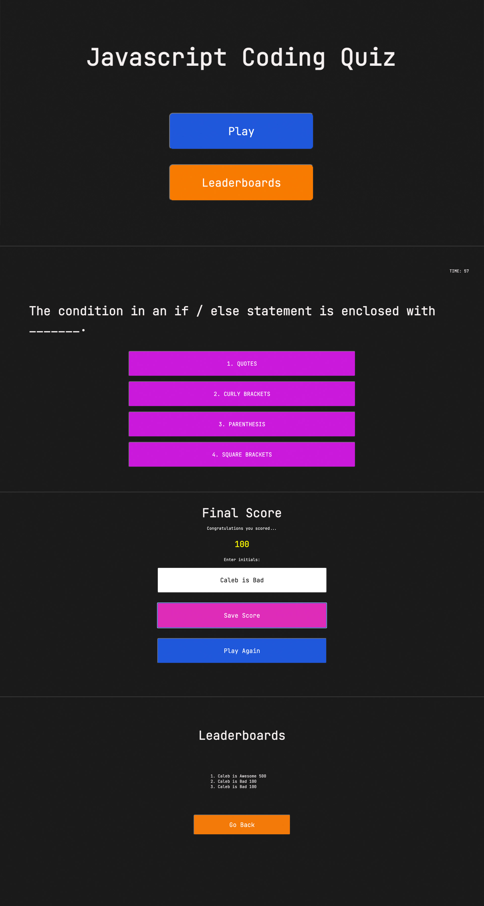

# Coding-Quiz
A Interactive coding quiz based off the fundamentals of Javascript.

## Table of contents
* [Introduction](#Introduction)
* [Technologies](#Technologies)
* [Preview](#Preview)
* [Live Page](#Portfolio)

## Introduction ##
This coding quiz is an interactive multiple choice quiz based off of of Javascript fundamentals. The application utilizes Local Storage by storing scores to it and calling them when the user interacts with the Leaderboard screen.

## Technologies ##
The application was designed through the use of HTML, CSS and made functional through the use of Javascript.

## Preview ##

## Live Page ##
Test the generator for yourself [Here](https://caleb-best.github.io/Coding-Quiz/)

